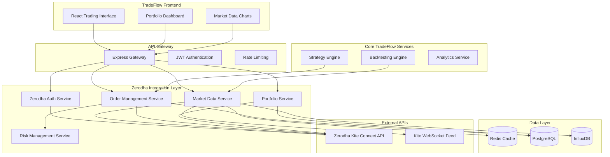

# Zerodha Integration Design

## Overview

The Zerodha integration will extend TradeFlow's existing architecture to support Indian stock markets through Zerodha's Kite Connect API. The design follows a microservices architecture with dedicated services for authentication, market data, order management, and portfolio tracking. The integration will be implemented as a new service layer that interfaces with Zerodha's REST API and WebSocket feeds while maintaining compatibility with TradeFlow's existing components.

## Architecture

### High-Level Architecture



### Service Architecture

The integration consists of five main services:

1. **Zerodha Authentication Service** - Handles OAuth flow and token management
2. **Market Data Service** - Manages real-time and historical market data
3. **Order Management Service** - Handles order placement, modification, and tracking
4. **Portfolio Service** - Manages positions, holdings, and P&L calculations
5. **Risk Management Service** - Enforces trading limits and risk controls

## Components and Interfaces

### 1. Zerodha Authentication Service

**Purpose**: Manages authentication flow with Zerodha and maintains access tokens.

**Key Components**:
- OAuth Flow Handler
- Token Storage and Encryption
- Session Management
- Token Refresh Logic

**API Endpoints**:
```typescript
POST /api/zerodha/auth/login
GET  /api/zerodha/auth/callback
POST /api/zerodha/auth/refresh
GET  /api/zerodha/auth/profile
DELETE /api/zerodha/auth/logout
```

**Integration Points**:
- Zerodha Kite Connect OAuth API
- TradeFlow User Service for user mapping
- Redis for session storage
- PostgreSQL for persistent token storage

### 2. Market Data Service

**Purpose**: Provides real-time market data, historical data, and instrument information.

**Key Components**:
- WebSocket Connection Manager
- Instrument Database Manager
- Real-time Data Normalizer
- Historical Data Cache
- Market Status Monitor

**API Endpoints**:
```typescript
GET    /api/zerodha/market/instruments
GET    /api/zerodha/market/search
POST   /api/zerodha/market/subscribe
DELETE /api/zerodha/market/unsubscribe
GET    /api/zerodha/market/quotes
GET    /api/zerodha/market/historical
GET    /api/zerodha/market/indices
WebSocket: /ws/market-data
```

**Data Structures**:
```typescript
interface MarketTick {
  instrument_token: number;
  exchange: string;
  tradingsymbol: string;
  last_price: number;
  volume: number;
  ohlc: { open: number; high: number; low: number; close: number };
  timestamp: Date;
}

interface Instrument {
  instrument_token: number;
  tradingsymbol: string;
  name: string;
  exchange: string;
  segment: string;
  lot_size: number;
  tick_size: number;
}
```

### 3. Order Management Service

**Purpose**: Handles all order-related operations including placement, modification, and tracking.

**Key Components**:
- Order Validator
- Zerodha API Client
- Order Status Monitor
- Order History Manager
- Error Handler

**API Endpoints**:
```typescript
POST   /api/zerodha/orders
PUT    /api/zerodha/orders/:orderId
DELETE /api/zerodha/orders/:orderId
GET    /api/zerodha/orders
GET    /api/zerodha/orders/:orderId
GET    /api/zerodha/orders/history/:orderId
```

**Data Structures**:
```typescript
interface OrderRequest {
  exchange: 'NSE' | 'BSE';
  tradingsymbol: string;
  transaction_type: 'BUY' | 'SELL';
  quantity: number;
  product: 'CNC' | 'MIS' | 'NRML';
  order_type: 'MARKET' | 'LIMIT' | 'SL' | 'SL-M';
  price?: number;
  trigger_price?: number;
  validity?: 'DAY' | 'IOC';
}

interface Order {
  order_id: string;
  status: string;
  tradingsymbol: string;
  quantity: number;
  filled_quantity: number;
  average_price: number;
  order_timestamp: string;
}
```

### 4. Portfolio Service

**Purpose**: Manages portfolio data including positions, holdings, and P&L calculations.

**Key Components**:
- Position Manager
- Holdings Calculator
- P&L Engine
- Margin Calculator
- Portfolio Aggregator

**API Endpoints**:
```typescript
GET /api/zerodha/portfolio/positions
GET /api/zerodha/portfolio/holdings
GET /api/zerodha/portfolio/margins
GET /api/zerodha/portfolio/pnl
GET /api/zerodha/portfolio/summary
```

**Data Structures**:
```typescript
interface Position {
  tradingsymbol: string;
  exchange: string;
  quantity: number;
  average_price: number;
  last_price: number;
  pnl: number;
  unrealised: number;
  realised: number;
}

interface Holding {
  tradingsymbol: string;
  quantity: number;
  average_price: number;
  last_price: number;
  pnl: number;
  day_change: number;
}
```

### 5. Risk Management Service

**Purpose**: Enforces trading limits and implements risk controls.

**Key Components**:
- Risk Rule Engine
- Position Monitor
- Limit Checker
- Alert Manager
- Auto Square-off Handler

**Configuration**:
```typescript
interface RiskLimits {
  max_order_value: number;
  max_daily_loss: number;
  max_position_size: number;
  max_orders_per_minute: number;
  allowed_products: string[];
  allowed_exchanges: string[];
}
```

## Data Models

### Database Schema

**Users Table** (extends existing):
```sql
ALTER TABLE users ADD COLUMN zerodha_user_id VARCHAR(50);
ALTER TABLE users ADD COLUMN zerodha_access_token TEXT;
ALTER TABLE users ADD COLUMN zerodha_refresh_token TEXT;
ALTER TABLE users ADD COLUMN token_expires_at TIMESTAMP;
```

**Zerodha Orders Table**:
```sql
CREATE TABLE zerodha_orders (
  id UUID PRIMARY KEY DEFAULT gen_random_uuid(),
  user_id UUID REFERENCES users(id),
  order_id VARCHAR(50) UNIQUE NOT NULL,
  exchange VARCHAR(10) NOT NULL,
  tradingsymbol VARCHAR(50) NOT NULL,
  transaction_type VARCHAR(10) NOT NULL,
  quantity INTEGER NOT NULL,
  product VARCHAR(10) NOT NULL,
  order_type VARCHAR(10) NOT NULL,
  price DECIMAL(10,2),
  trigger_price DECIMAL(10,2),
  status VARCHAR(20) NOT NULL,
  filled_quantity INTEGER DEFAULT 0,
  average_price DECIMAL(10,2) DEFAULT 0,
  order_timestamp TIMESTAMP NOT NULL,
  created_at TIMESTAMP DEFAULT NOW(),
  updated_at TIMESTAMP DEFAULT NOW()
);
```

**Zerodha Positions Table**:
```sql
CREATE TABLE zerodha_positions (
  id UUID PRIMARY KEY DEFAULT gen_random_uuid(),
  user_id UUID REFERENCES users(id),
  tradingsymbol VARCHAR(50) NOT NULL,
  exchange VARCHAR(10) NOT NULL,
  quantity INTEGER NOT NULL,
  average_price DECIMAL(10,2) NOT NULL,
  last_price DECIMAL(10,2),
  pnl DECIMAL(15,2),
  unrealised DECIMAL(15,2),
  realised DECIMAL(15,2),
  position_date DATE NOT NULL,
  created_at TIMESTAMP DEFAULT NOW(),
  updated_at TIMESTAMP DEFAULT NOW(),
  UNIQUE(user_id, tradingsymbol, exchange, position_date)
);
```

### Redis Cache Structure

**Market Data Cache**:
```
quote:{exchange}:{symbol} -> JSON (TTL: 60 seconds)
instrument:{exchange}:{symbol} -> JSON (TTL: 24 hours)
search:{query} -> JSON array (TTL: 1 hour)
```

**Session Cache**:
```
session:{user_id} -> JSON (TTL: 8 hours)
rate_limit:{user_id} -> counter (TTL: 60 seconds)
```

## Error Handling

### Error Categories

1. **Authentication Errors**
   - Invalid credentials
   - Token expiration
   - API key issues

2. **Market Data Errors**
   - WebSocket disconnection
   - Invalid instrument tokens
   - Rate limiting

3. **Order Errors**
   - Insufficient funds
   - Invalid order parameters
   - Market closed

4. **System Errors**
   - Database connection issues
   - Redis unavailability
   - Network timeouts

### Error Response Format

```typescript
interface ErrorResponse {
  success: false;
  error: {
    code: string;
    message: string;
    details?: any;
    timestamp: string;
  };
}
```

### Circuit Breaker Pattern

Implement circuit breakers for external API calls:
- **Closed**: Normal operation
- **Open**: Stop making calls after failure threshold
- **Half-Open**: Test if service has recovered

## Testing Strategy

### Unit Testing
- Service layer logic
- Data transformation functions
- Validation rules
- Error handling

### Integration Testing
- Zerodha API integration
- Database operations
- Redis caching
- WebSocket connections

### End-to-End Testing
- Complete order flow
- Authentication workflow
- Market data streaming
- Portfolio calculations

### Performance Testing
- API response times
- WebSocket latency
- Database query performance
- Concurrent user handling

### Security Testing
- Token encryption/decryption
- API key protection
- Input validation
- SQL injection prevention

## Deployment Architecture

### Container Structure
```yaml
services:
  zerodha-auth-service:
    image: tradeflow/zerodha-auth:latest
    environment:
      - ZERODHA_API_KEY
      - ZERODHA_API_SECRET
      - JWT_SECRET
    
  zerodha-market-service:
    image: tradeflow/zerodha-market:latest
    environment:
      - REDIS_URL
      - INFLUXDB_URL
    
  zerodha-order-service:
    image: tradeflow/zerodha-order:latest
    environment:
      - DATABASE_URL
      - REDIS_URL
```

### Load Balancing
- Use NGINX for load balancing across service instances
- Implement sticky sessions for WebSocket connections
- Configure health checks for service discovery

### Monitoring and Observability
- Prometheus metrics for API performance
- Grafana dashboards for system monitoring
- ELK stack for centralized logging
- Jaeger for distributed tracing

## Security Considerations

### API Security
- Store API keys in encrypted environment variables
- Use HTTPS for all API communications
- Implement request signing for sensitive operations
- Rate limiting to prevent abuse

### Data Protection
- Encrypt sensitive data at rest
- Use secure WebSocket connections (WSS)
- Implement proper session management
- Regular security audits

### Access Control
- Role-based access control (RBAC)
- API key rotation policies
- User activity logging
- Suspicious activity detection

## Performance Optimization

### Caching Strategy
- Redis for frequently accessed data
- CDN for static assets
- Database query optimization
- Connection pooling

### Scalability
- Horizontal scaling of services
- Database sharding if needed
- Message queues for async processing
- Auto-scaling based on load

### Latency Optimization
- WebSocket connection pooling
- Batch API requests where possible
- Optimize database queries
- Use compression for large responses